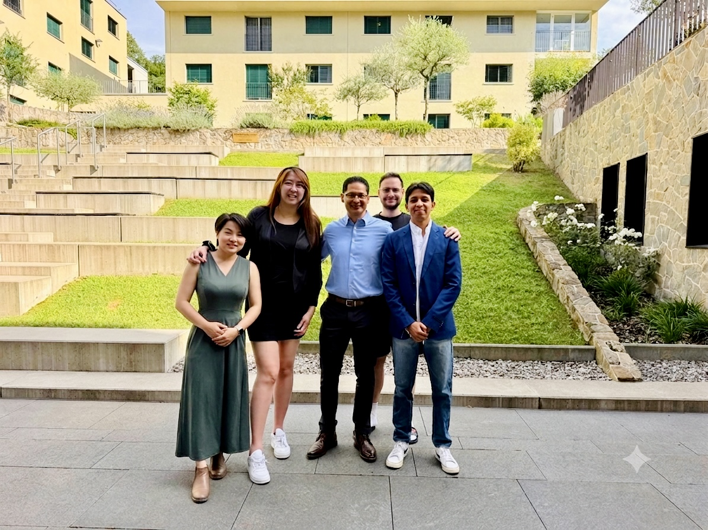

<div align="center">

# ₿ SatsBase

### The Bank That Runs on Bitcoin

**Bitcoin-backed peer-to-peer lending for the people traditional finance wrote off.**

[](https://plan-b-lending.vercel.app)
&nbsp;

&nbsp;


</div>

---

> *WIRED × TechCrunch · Special Feature · June 2026 — Bitcoin · Microfinance · Lean Startup*

SatsBase has a simple, radical pitch: **use Bitcoin as collateral to give credit to the people traditional finance decided weren't worth the trouble.**

Maria sells pupusas on a street corner in San Salvador. She needs **$150** in working capital to meet a spike in demand. She has a real business, a real track record, and zero access to a bank loan — the underwriting cost alone would exceed the value of the credit. By every metric of traditional finance, Maria is not bankable.

**SatsBase says that's the wrong metric.**

---

## 💡 What It Is

A **three-sided marketplace** that connects borrowers like Maria with investors, using Bitcoin as collateral — **not the borrower's Bitcoin.** She doesn't need to own any. The collateral comes from an approved partner: a government programme, an NGO, or an institutional sponsor who posts BTC on her behalf under agreed loan terms.

- 🟢 **Borrowers** — micro-merchants who need working capital, no crypto required
- 🔵 **Investors** — browse vetted borrower profiles and earn yield on every funded loan
- 🟠 **Collateral Sponsors** — governments, NGOs, and impact funds who post BTC to unlock credit

All loans are **overcollateralised** — the Bitcoin posted exceeds the loan value, so even a significant BTC price drop leaves the investor's principal intact.

---

## ⚙️ How the Machine Works

| Step | Stage | What Happens |
|:---:|---|---|
| **1** | **Merchant Applies** | KYC, reputation check, repayment module configured |
| **2** | **Partner Posts BTC** | Collateral committed under agreed loan terms |
| **3** | **Investor Funds** | Capital deployed with full collateral visibility |
| **4** | **Repay or Settle** | Daily automated repayment; on default, collateral activates |

Disbursement is **stablecoins only** — USDT or USDC — wired directly to the borrower's digital wallet. No cash handling. No brick-and-mortar branch. In a country where **75% of bank branches cluster in major cities**, that matters enormously.

The platform earns **origination and servicing fees** on successful loans — *not interest*. Every repaid loan also becomes a borrower's first-ever **on-chain credit record**.

---

## 📊 El Salvador Pilot

<div align="center">

| `$100K` | `600+` | `2×` |
|:---:|:---:|:---:|
| **Pilot Loan Pool** | **Target Micro-Loans** | **Overcollateralised** |

</div>

El Salvador became the world's first country to adopt Bitcoin as legal tender in 2021. The infrastructure that followed — the Chivo wallet, the Bitcoin Beach community in El Zonte — created exactly the conditions SatsBase needs: an existing Bitcoin ecosystem, digitally literate merchants, and a population acutely aware of the cost of being excluded from formal credit.

---

## 🚀 Why Bitcoin — and Why Now

Bitcoin is **trustless and verifiable** in a way that Treasury bills and gold are not, especially across borders. The 2× overcollateralisation absorbs volatility. And in communities where Bitcoin is already the preferred savings vehicle — not from ideology, but because local currencies have repeatedly failed them — **it's the only collateral that actually exists.**

---

## 👥 The Team

<div align="center">



*The SatsBase team — Lynn, Milly, Karim, Mario, and Jose — at the innovation campus during the final build sprint.*

</div>

A five-person team spanning **Taiwan, Lebanon, and El Salvador** that refused to stay in its lane:

| Member | Role |
|---|---|
| **Lynn** | Research Lead & Co-founder — her research on developing-world credit markets sparked the entire pivot |
| **Milly** | Project Manager & Co-founder — Taiwanese banking veteran who held the structure through five pivots |
| **Karim** | Strategy → Technical Architecture & UI/UX — shifted lanes the moment the product demanded it |
| **Mario** | Software Developer — built the technical backbone |
| **Jose** | Co-founder & Idea Architect — Salvadoran, brought years of on-the-ground Bitcoin research |

> *"The pharmacy idea was a good solution. This is a necessary one. Once we saw the data on the unbanked, we couldn't look away."* — **Lynn**

---

## 🧪 Run the Demo

This repo ships a self-contained front-end demo (single-page app, no build step).

```bash
# Clone and serve the Dashboard locally
git clone https://github.com/Mirakkkk/plan-b-hackathon.git
cd plan-b-hackathon
python3 -m http.server 8000
# open http://localhost:8000/Dashboard/
```

Or just visit the live deployment: **[plan-b-lending.vercel.app](https://plan-b-lending.vercel.app)**

---

<div align="center">

*SatsBase betting that collateral was never the problem. **Recognition was.***

**SatsBase · Wired × TechCrunch Special Feature · June 2026 · Bitcoin-Backed P2P Lending**

</div>
